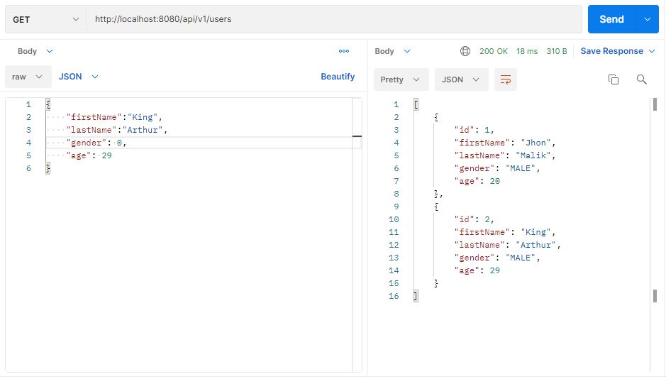
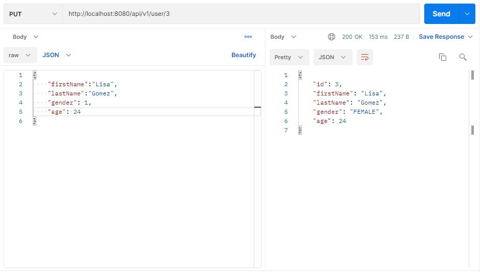
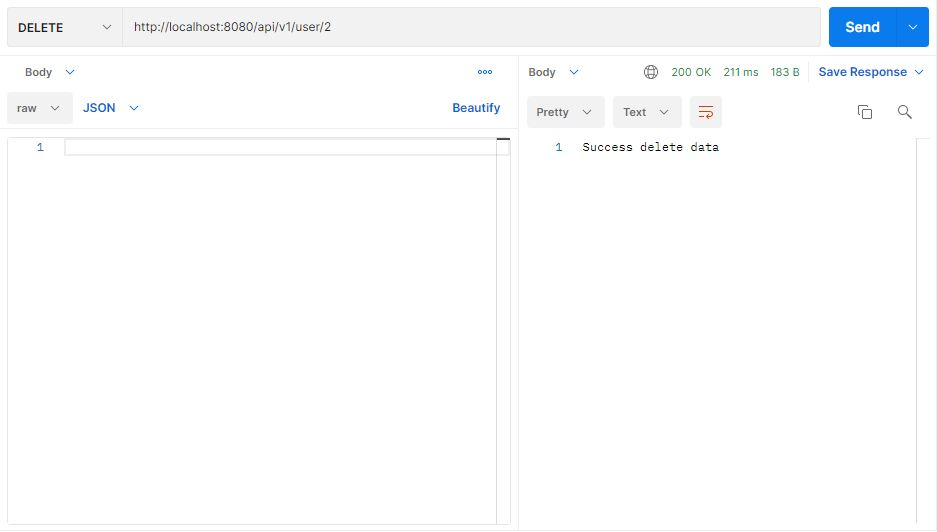

# Spring-Boot-Rest-API-with-MySQL
## Build Rest API With Spring Boot Framework and MySQL database

### Technology
* Maven 3.0+
* IDE(Eclipse or IntelliJ)
* JDK 1.8+
* MYSQL database server
* Postman for testing

### Configure Spring Datasource, JPA, Hibernate
**The configuration is in the application.properties file**

* Setting `spring.datasource.username` & `spring.datasource.password` properties are the same as your database installation.
* Spring Boot uses Hibernate for JPA implementation, we configure `MySQL8Dialect` for MySQL
* `spring.jpa.hibernate.ddl-auto` is used for database initialization. We set the value to update value so that a table will be created in the database automatically corresponding to defined data model. Any change to the model will also trigger an update to the table. For production, this property should be `validate`.

## Test

* Get List Data

* Get Data By Id

* Post Data

* Update Data

* Delete Data

